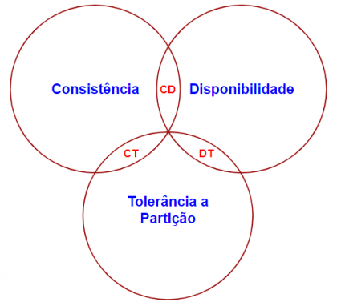

# Aerospike: Por que é uma escolha para sistemas de baixa latência em tempo real?

     

Banco de dados NoSQL estão se tornando cada vez mais populares entre desenvolvedores e empresas atualmente, especialmente por que eles
são capazes de lidar com enormes volumes de dados, capazes de leitura e escrita extremamente rápidos e são mais fáceis de escalar horizontamente
do que os bancos de dados relacionais tradicionais.

Exemplos que ficaram bastante populares na industria nos ultimos anos são o MongoDB, Cassandra, Redis, Couchbase, entre outros. Apesar de todos serem NoSQL,
eles não poderiam ser mais diferentes entre si.

Pegue por exemplo, o MongoDB, um banco de dados NoSQL orientado a documentos, diferente de um banco relacional, que armazena os dados em linhas e colunas,
o MongoDB armazena os dados em documentos BSON (Binary JSON), que são semelhantes a objetos JSON. Isso permite que os desenvolvedores armazenem dados de forma mais flexível,
sem a necessidade de definir um esquema rígido.

O Redis, um banco chave-valor, que armazena os dados como pares de chave-valor, permitindo que os desenvolvedores armazenem e recuperem dados rapidamente.
O Redis é frequentemente usado para cache, filas de mensagens e contadores em tempo real, devido à sua alta velocidade e baixa latência.

Ou o Cassandra, um banco orientado a colunas desenvolvido pelo Facebook, que armazena os dados em colunas em vez de linhas, permitindo consultas tanto de escritas
quanto de leituras de forma rápidas e eficientes.
Muito usado para aplicações que precisam de alta disponibilidade e escalabilidade, como análises em tempo real e armazenamento de séries temporais.

Enfim, as possibilidades do NoSQL são inúmeras e mais bancos de dados NoSQL estão sendo desenvolvidos para atender a diferentes necessidades.

Então, entra na jogada, o Aerospike, um banco de dados, escrito em C, chave-valor assim como o Redis.
O Aerospike é um Dbaas, Database as a Service, é um modelo de serviço em que um provedor de nuvem gerencia e disponibiliza um banco de dados para os usuários por meio de uma plataforma online.
Nesse modelo, o provedor cuida de toda a infraestrutura necessária, incluindo provisionamento, escalabilidade, backups, manutenção e atualizações,
permitindo que os usuários se concentrem no uso do banco de dados para suas aplicações, sem precisar se preocupar com a complexidade da gestão de servidores ou configuração.

Seu principal diferencial em relação a outros BDs chave-valor é sua absurda capacidade de leitura e escrita em tempo real, com latência extremamente baixa.

Aqui está uma amostra de sua velocidade.

     

Está é uma pequena comparação da velocidade de leitura e escrita entre Aerospike e Redis.

Basicamente, o Aerospike faz quase 5 vezes mais leituras e escritas por segundo do que o Redis utilizando apenas uma máquina no cluster. Esse número tende a diminuir conforme
nos adicionamos mais máquinas ao cluster, mas o Aerospike ainda é consideravelmente mais rápido que o Redis.

Além de sua incrível velocidade e alta escalabilidade, o Aerospike também tende a ser mais barato que seus concorrentes
devido ao máximo uso do hardware de cada máquina, são necessárias menos máquinas para atender a mesma demanda.

## Onde o Aerospike se encaixa no CAP?

O Teorema CAP é um princípio fundamental na ciência da computação, usado para descrever as características de sistemas distribuídos, como bancos de dados modernos.
Ele afirma que em um sistema distribuído é impossível garantir simultaneamente as três propriedades a seguir:

     

- Consistência (Consistency): Todos os nós do sistema veem os mesmos dados ao mesmo tempo.
  Isso significa que uma leitura retorna sempre os dados mais recentes, mesmo em um ambiente distribuído.

- Disponibilidade (Availability): O sistema sempre responde a solicitações, mesmo que alguns nós estejam inativos ou desconectados.
  Não há "tempo de inatividade" para o usuário.

- Tolerância a Partições (Partition Tolerance): O sistema continua operando mesmo que haja falhas de comunicação ou interrupções (partições) entre os nós da rede.

De acordo com o teorema CAP, um sistema distribuído só pode garantir duas dessas propriedades simultaneamente, mas não todas as três. Portanto, cabe aos desenvolvedores
escolherem quais propriedades são mais importantes para suas aplicações.

O Aerospike é um banco de dados distribuído projetado para priorizar Disponibilidade e Tolerância a Partições no contexto do Teorema CAP,
mas com fortes mecanismos configuráveis para oferecer Consistência quando necessário.

## A pergunta que não quer se calar: Por que o Aerospike é tão rápido?

- Aerospike Smart Client: O Aerospike utiliza um cliente inteligente que atua como intermediário entre suas aplicações e o cluster de banco de dados.
  Esse cliente inteligente cuida dos detalhes técnicos, como selecionar os nós corretos, gerenciar tentativas de repetição e ajustar-se às mudanças na configuração do cluster.
  Ao fazer isso, ele simplifica o processo de desenvolvimento para os desenvolvedores de aplicações,
  permitindo que eles se concentrem na construção de suas aplicações sem se preocupar com as complexidades do banco de dados.

- Camada de Modelo de Dados: A camada de modelo de dados do Aerospike é projetada para eficiência e flexibilidade.
  Ela permite armazenar e recuperar dados de uma maneira que faça sentido para sua aplicação, seja lidando com pares simples de chave-valor ou com estruturas de dados mais complexas.
  Essa flexibilidade garante que o Aerospike possa lidar com uma ampla gama de casos de uso, desde cache e gerenciamento de sessões até análises em tempo real e personalização.

- Clusters Inteligentes: A arquitetura do Aerospike é construída em torno de clusters inteligentes, onde cada nó opera de forma independente.
  Essa arquitetura shared-nothing (sem compartilhamento de recursos) melhora a escalabilidade, tornando fácil adicionar novos nós ao cluster sem interromper as operações.
  Ela também melhora a tolerância a falhas, pois a falha de um nó não derruba todo o cluster.

- Memória Híbrida: O Aerospike suporta um modelo de armazenamento híbrido, combinando armazenamento em memória e flash.
  Os dados acessados com mais frequência são armazenados na RAM para acesso ultrarrápido, enquanto os dados menos acessados são armazenados no armazenamento flash,
  oferecendo uma solução custo-efetiva e com maior capacidade.
  Essa abordagem híbrida garante que o Aerospike possa oferecer alta performance e escalabilidade sem comprometer o orçamento.

Além disso, o Aerospike oferece Replicação entre Datacenters (XDR),
permitindo replicar dados entre clusters distribuídos geograficamente para garantir consistência de dados e recuperação em caso de desastres.

## Porque escolher o Aerospike a seus concoorrentes?

Para responder a essa pergunta, vamos comparar o Aerospike com alguns de seus concorrentes mais populares: Redis e Memcached.

- O Aerospike se destaca por sua arquitetura de memória híbrida, que combina os benefícios do armazenamento em memória e em disco para cenários de cache.
  Ele oferece desempenho robusto, durabilidade e recursos de consistência, tornando-o adequado para aplicações de cache distribuído.

- O Redis, embora também seja uma solução de cache poderosa, depende exclusivamente da RAM e oferece opções de persistência,
  mas pode ser menos eficiente em termos de armazenamento para conjuntos de dados maiores.

- Já o Memcached é leve e simples, operando exclusivamente em memória, sem suporte nativo para persistência ou transações,
  o que o torna adequado para cache básico de pares chave-valor, mas carece dos recursos avançados oferecidos pelo Aerospike.

## Conclusão

O Aerospike se destaca como uma solução robusta e eficiente para sistemas que exigem alta performance, baixa latência e escalabilidade em tempo real. Com uma arquitetura projetada para aproveitar ao máximo o hardware disponível, o banco oferece vantagens claras sobre concorrentes como Redis e Memcached, especialmente em cenários que envolvem grandes volumes de dados, alto número de leituras e escritas, e necessidade de persistência confiável.

Sua capacidade de operar em memória híbrida, suporte a clusters inteligentes e funcionalidades como replicação entre datacenters o tornam ideal para aplicações críticas, como análise de dados em tempo real, personalização de conteúdo e gestão de sessões. Além disso, sua compatibilidade com o modelo CAP, priorizando Disponibilidade e Tolerância a Partições, garante confiabilidade em ambientes distribuídos.

Portanto, para empresas que buscam um banco de dados que combine desempenho excepcional, flexibilidade e custo-benefício, o Aerospike é uma escolha estratégica e poderosa.
