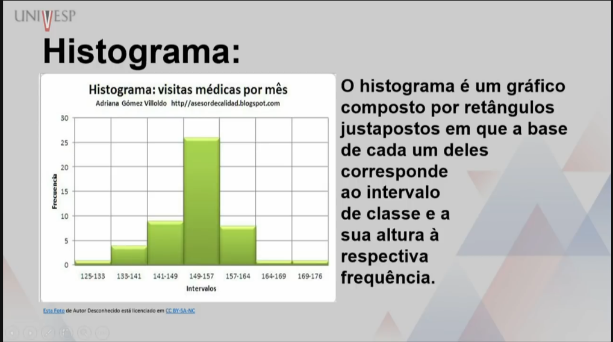
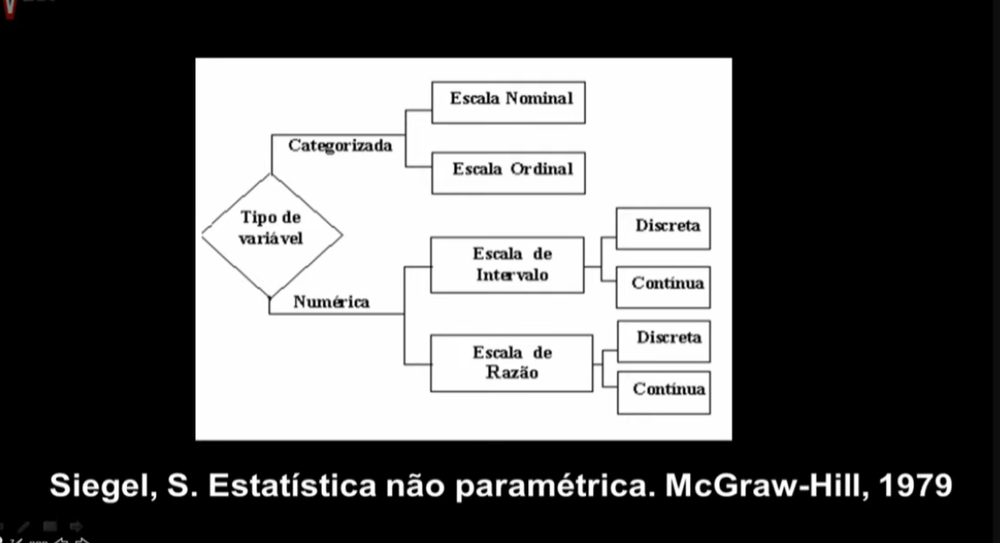
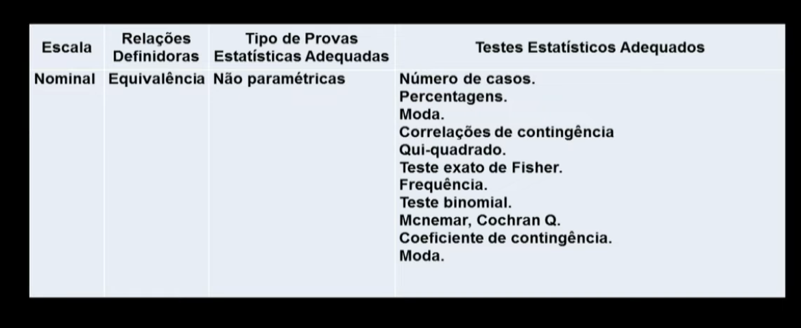
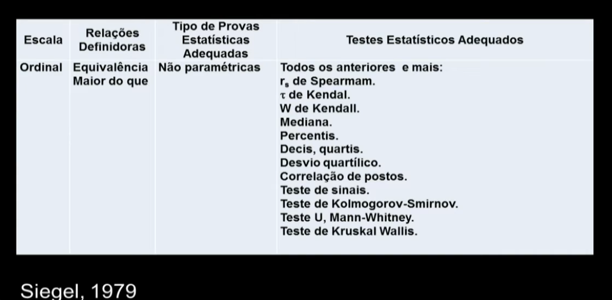
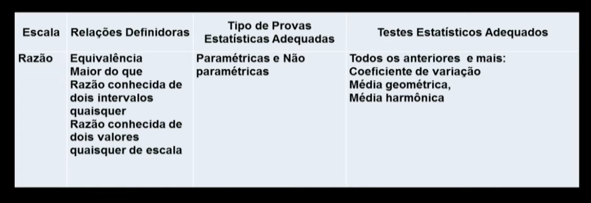
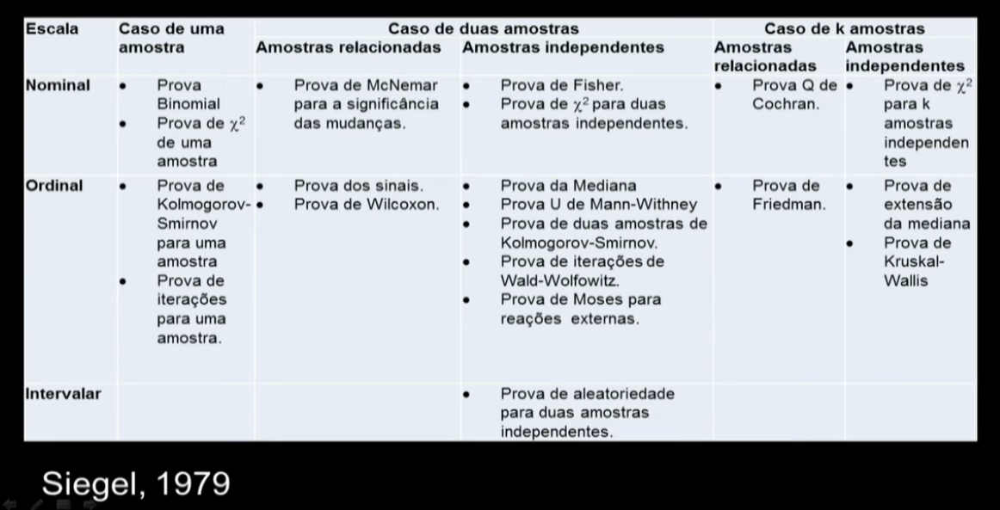

# Conceitos de estatistica

______________________________________________________________________

**Date:** 2026-03-13
**Tags:** [Uf](../tags/Uf.md), [Probabilidade](../tags/Probabilidade.md), [Estatistica](../tags/Estatistica.md)
**URL:** [watch?v=BV67KHwV-5A](https://www.youtube.com/watch?v=BV67KHwV-5A)

______________________________________________________________________

## O que é estatística?

**Estatística** é a ciência de coletar, organizar, analisar, interpretar e apresentar dados a fim de tomar decisões ou inferências sobre um fenômeno.

## O que sao dados

Os dados consistem em informacoes provenientes de observacoes, contagem, medidas ou respostas.

## Estatística descritiva vs inferencial

- **Descritiva**: sumariza os dados que temos (média, mediana, moda, desvio padrão), e representa visualmente (gráficos, tabelas).
- **Inferencial**: é o ramo que trata de tirar conclusoes sobre uma populacao a aprtir de uma amostra. A ferramenta basica no estudo da estatistica inferencial é a probabilidade.

## Populacao e Amostra

- **Populacao**: Todos os elementos que podem participar da pesquisa.
- **Amostra:** Pequena parcela da populacao, deve ser representativa para englobar a populacao.

## Técnicas de amostragem

- **Amostragem aleatoria simples:** sorteio simples entre a populacao
- **Amostragem aleatoria estratificada:** sorteio proporcionado da populacao separado por estratos, ex: estrado do sexo feminino/masculino
- **Amostragem por sistematica:** sorteio de pessoas por criterio pre estabelecido
- **Amostragem por Conglomerado:** sorteio de pessoas por regiao, ex: pessoas de um bairro da cidade

## Variavel estatistica

É a caracteristica ou a propriedade que sera estudada ou observada na populacao

- Qualitativa nominal: qualidade da pessoa, ex: cor do cabelo, bairro que mora, candidato que vai votar.
- Qualitativa ordinal: qualidade que possuem classificacao, ex: nivel socioeconomico, nivel de escolaridade, quem chegou em primeiro, segundo e terceiro lugar
- Quantitativa discreta: só entra números inteiros, ex: Pessoas, objetos
- Quantitativa continua: pode entrar números quebrados, ex: volume, peso, etc

## Fases do método estatitisco

- Definicao do problema
- Planejamento da pesquisa
- Coelta dos dados
- Apuracao dos dados
- Exposicao ou apresentacao dos dados
- Analise dos dados

## Tipos de graficos

### Grafico de linha

### Grafico de colunas

### Grafico de barras

### Grafico de pizza

### Histograma

## Niveis de mensuracao

### Nominal

Mensuracao em um nivel mais baixo ou primitivo das possibilidades
A primeira organizacao de dados -> constitui-se em colocar as caracteristica de individuos ou de objetos em categorias e contar a frequencia com que ocorrem, ex: sexo, classe socioeconomica, partido politico, orientacao no tempo

### Ordinal

Quando se quer ultrapassar a simplesatribuicao de um rotulo ou nome a um individuo ou objeto, pode-se classificar os dados em categorias de um ordenamento preestabelecido, ex:

- Ordenacao do grau de concordancia com uma assertiva (concordo plenamento, concordo, indiferente, discordo e discordo plenamente)
- Avaliação de um produto (ruim, regular, bom, otimo)
- Classificacao de alunos (1o, 2o, 3o, etc)

Fornece informacao sobre a posicao relativa dos dados, mas nao sobre a diferenca entre eles. Ex: a diferenca entre o 1o e o 2o lugar pode ser diferente da diferenca entre o 2o e o 3o lugar.

### Intervalar

Quando se tem a possibilidade de medir a diferenca entre os dados, mas nao se tem um ponto zero absoluto, ex: temperatura em graus Celsius ou Fahrenheit. A diferenca entre 20°C e 30°C é a mesma que entre 30°C e 40°C, mas 0°C nao significa ausencia de temperatura.
Ex: Temperatura, altura, receitas de vendas, renda, investimento em propaganda, tempo, etc

#### Razao ou proporcional

Quando se tem um ponto zero absoluto, ou seja, a ausencia total da caracteristica medida, ex: peso, altura, tempo gasto para realizar uma tarefa. A diferenca entre 0 kg e 10 kg é a mesma que entre 10 kg e 20 kg, e 0 kg significa ausencia de peso.

Em todos os casos podemos ter mensuracoes com valores discretos quando sao expressos por numeros naturais (interios positivos), como ocorre com numeros de filgos ou valores continuos tais como nas unidades fisicas que em tese, podem ser indefinidamente subdivididos.

## imagens

## Perguntas e respostas (Guia Semana 1)

**PDF:** [Aula - Semana 1 - Guia 1](../assets/Aula_-_Semana_1_-_Guia-1.pdf)

### Conceitos (perguntas do guia)

- **Estatística e sua divisão**

  - **Descritiva:** organiza e resume dados (tabelas, gráficos, média/mediana/desvio padrão).
  - **Inferencial:** usa uma **amostra** para concluir algo sobre a **população** (probabilidade + modelos).

- **Fenômeno a ser estudado**: o “evento/situação do mundo real” que você quer entender com dados.

  - Ex.: “tempo que alunos levam para executar um programa no laboratório”.

- **O que observar de um fenômeno**: a(s) **variável(is)** (características mensuráveis/observáveis) do fenômeno.

  - Ex.: tempo (s), número de erros, sistema operacional, nível de satisfação.

- **Dados e seus tipos**

  - **Qualitativos:** categorias (nominal/ordinal).
  - **Quantitativos:** números (discreto/contínuo).

- **Como coletar dados**: observação/medição (tempo, tamanho, peso), contagem (nº de erros), questionário/entrevista (satisfação), logs/sensores/sistemas.

- **Unidades de medida**: o “padrão” usado para medir a variável.

  - Ex.: segundos (tempo), bytes (tamanho de arquivo), requisições/min (taxa), % (proporção).

- **Tipos de pesquisa** (visão geral):

  - **Censo:** mede toda a população.
  - **Amostral:** mede uma parte (amostra) da população.

- **Tipos de amostra** (exemplos comuns): aleatória simples, estratificada, sistemática, conglomerado.

- **Formas de organização dos dados**: listas, tabelas (frequência), ordenação, agrupamento em classes/intervalos.

- **Tabelas**: exibem dados de forma estruturada (ex.: tabela simples ou de frequências).

- **Gráficos**: representação visual (barras/colunas/pizza/linha/histograma), escolhidos conforme o tipo de dado.

### Exercício 1 — Classificação do tipo de dado

a) Número de downloads de um aplicativo em um dia: **quantitativo discreto**

b) Sistema operacional utilizado por um usuário (Windows, Linux, MacOS): **qualitativo nominal**

c) Tempo de execução de um algoritmo (em segundos): **quantitativo contínuo**

d) Nível de satisfação do usuário (baixo, médio, alto): **qualitativo ordinal**

e) Número de erros registrados em um servidor: **quantitativo discreto**

### Exercício 2 — Contextualização de dados

Tempos (s): 12, 15, 11, 14, 13, 12, 16, 14, 13, 12

| Execução | Tempo (s) |
|---:|---:|
| 1 | 12 |
| 2 | 15 |
| 3 | 11 |
| 4 | 14 |
| 5 | 13 |
| 6 | 12 |
| 7 | 16 |
| 8 | 14 |
| 9 | 13 |
| 10 | 12 |

- **Fenômeno estudado:** tempo que estudantes levam para executar um programa em Python durante um laboratório.
- **Variável observada:** tempo de execução (em segundos).
- **Tipo de dado:** **quantitativo contínuo** (tempo é uma medida contínua, mesmo que registrado como inteiro).
