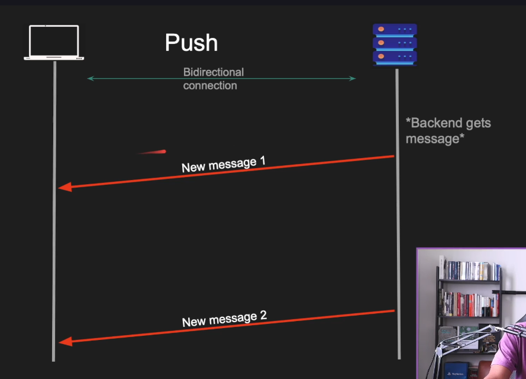

# Push

______________________________________________________________________

**Date:** 2026-04-11
**Tags:**[Udemy.md](tags/Udemy.md), [Push.md](tags/Push.md), [Backend_communication_design_patterns.md](tags/Backend_communication_design_patterns.md), [Fundamentals_of_backend_engineering.md](tags/Fundamentals_of_backend_engineering.md)
**URL:**

______________________________________________________________________

## Request/response inst always ideal

- CLient wants real time notification from backend
  - A user just logged in
  - A message is just received
- Push model is good for certain cases

## What is push?

- Client connects to a server
- Server sends data to the client
- Client doesnt have to request anything
- Protocol must be bidirectional (tcp, ws, http2)
- Used by RabbitMQ

## push pros and cons

- Pros:
  - Real time data transfer
- Cons:
  - Client must be online
  - Clients might not be able to handle
  - Requires a bidirectional protocol
  - Polling is preferred for light clients

## Demo js
