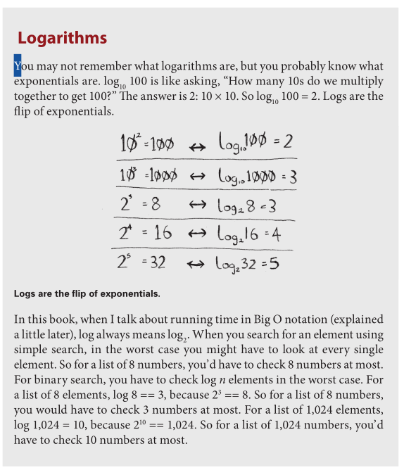
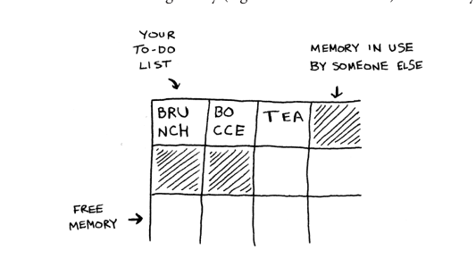
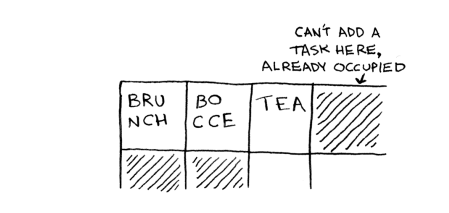
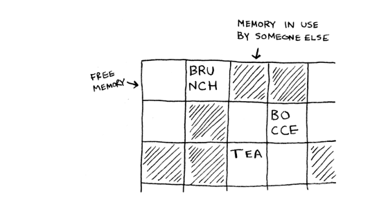

# grokking_algorithms

______________________________________________________________________

**Date:** 2026-02-22
**Tags:** [Algoritmos.md](tags/Algoritmos.md), [Leet_code.md](tags/Leet_code.md), [Books.md](tags/Books.md), [Grokking_Algorithms.md](tags/Grokking_Algorithms.md)
**URL:**

______________________________________________________________________

## Introduction



Memory works like a chess of drawers, each drawer can hold one element, and each drawer has its own address, fe0ffeeb is the address of a slot in memory. Every time you want to store a item in memory, you ask the computer for a slot, if you want to store multiple items, there are two basic ways to do that: arrays and lists Every time you want to store a item in memory, you ask the computer for a slot, if you want to store multiple items, there are two basic ways to do that: arrays and lists

## Big O Notation

Big O notation is a way to describe how an algorithm’s running time (or memory usage) *grows* as the input size `n` grows. Instead of measuring seconds, you count how many “basic operations” an algorithm does and focus on the growth rate.

Key ideas (as used throughout *Grokking Algorithms*):

- **Growth, not exact time**: Big O ignores machine speed and implementation details; it answers “how does this scale?”
- **Drop constants**: if an algorithm takes `c * n` steps, it’s still `O(n)`; constants don’t change the curve.
- **Worst case is common**: many runtimes are discussed as worst-case Big O (though some algorithms have important average-case behavior).

Common runtimes you’ll see:

- `O(1)` **constant time**: time doesn’t depend on `n` (e.g., array index lookup).
- `O(log n)` **logarithmic time**: input shrinks by a constant factor each step (e.g., binary search halves the search space).
- `O(n)` **linear time**: work grows proportionally with `n` (e.g., simple search through a list).
- `O(n log n)` **linearithmic time**: typical of efficient sorts (e.g., quicksort/mergesort average-case).
- `O(n^2)` **quadratic time**: often shows up with nested loops over the same data (e.g., selection sort, comparing every pair).

When combining steps, the slowest-growing term is what matters:

- Doing `O(n)` work and then `O(log n)` work is `O(n)` overall.
- Doing `O(n)` work inside a loop that runs `n` times becomes `O(n^2)`.

### exercises

- 1.3 You have a name, and you want to find the person’s phone number in the phone book.
  O(log n) i will part the book in half and check if i find the name, if i dont, im gonna halve it again until i do.
- 1.4 You have a phone number, and you want to find the person’s name in the phone book. (Hint: You’ll have to search through the whole book!)
  O(n) if i have to check one name at a time, i will have to check the whole book in the worst case.
- 1.5 You want to read the numbers of every person in the phone book.
  O(n) same as 1.4
- 1.6 You want to read the numbers of just the As. (This is a tricky one! It involves concepts that are covered more in chapter 4. Read the answer—you may be surprised!)
  O(log n) if the phone book is sorted, i can find the first A in O(log n) and then read all the As in O(n) but since we are only interested in the As, we can ignore the rest of the book and just read the As, so it would be O(log n) + O(n) = O(n)

## Binary Search

A binary search works by starting in the middle and narrowing down from there, take it for example, a search for a name in a phone book, Rafael in this case.
It makes more sense to search for the name Rafael starting from the middle in the phone book and then narrowing down from there, instead of starting from A, you'll start from M.
its input is a sorted list of elements (I’ll explain later why it needs to be sorted). If an element you’re looking for is in that list, binary search returns the position where it’s located. Otherwise, binary search returns null.

The time complexity of binary search is O(log n) because with each step, it cuts the number of elements to be checked in half. The space complexity is O(1) for the iterative version, as it only uses a constant amount of space, and O(log n) for the recursive version due to the call stack.

To use binary search, the list must be sorted. If the list is not sorted, binary search will not work correctly because it relies on the ability to eliminate half of the remaining elements based on comparisons.

```ts
function binarySearch(arr: number[], target: number): number | null {
  let left = 0; // Start of the array
  let right = arr.length - 1; // End of the array

  while (left <= right) { // continue searching while we havent narrowed down to one element
    const mid = Math.floor((left + right) / 2); // Calculate the middle index
    if (arr[mid] === target) { // found the item
      return mid;
    } else if (arr[mid] < target) { // the guess was too low 
      left = mid + 1;
    } else { // the guess was too high
      right = mid - 1;
    }
  }
  return null; // target was not found in the array
}
```

### exercises

- 1.1 Suppose you have a sorted list of 128 names, and you’re searching through it using binary search. What’s the maximum number of steps it would take?
  7, since log2(128) = 7

- 1.2 Suppose you double the size of the list to 256 names. What’s the maximum number of steps now?
  8, since log2(256) = 8

## Arrays and Lists

An array is a data structure that stores a fixed number of values of the same type. It is a contiguous block of memory where each element can be accessed directly using its index. Arrays have a fixed size, which means that once you create an array, you cannot change its size. The time complexity for accessing an element in an array is O(1) because you can directly access any element using its index.
Big O notation for arrays:

- Accessing an element: O(1)
- Inserting or deleting an element: O(n)





A list, on the other hand, is a data structure that can grow and shrink in size. It is typically implemented as a linked list, where each element (called a node) contains a value and a reference to the next node in the list. Lists do not have a fixed size, and you can add or remove elements from it. The time complexity for accessing an element in a linked list is O(n) because you have to traverse the list from the beginning to find the desired element.
Big O notation for linked lists:

- Accessing an element: O(n) because you have to traverse the list to find the element.
- Inserting or deleting an element: O(1) because you can simply add the new node at the beggining or end of the list without needing to shift any elements.



### exercises

- 2.1 Suppose you’re building an app to keep track of your finances. Every day, you write down everything you spent money on. At the end of the month, you review your expenses and sum up how much you spent. So, you have lots of inserts and a few reads. Should you use an array or a list?
  A list, because insert are more common than reads and lists do inserts at constant time while arrays do it at linear time.
- 2.2 Suppose you’re building an app for restaurants to take customer orders. Your app needs to store a list of orders. Servers keep adding orders to this list, and chefs take orders off the list and make them. It’s an order queue: servers add orders to the back of the queue, and the chef takes the first order off the queue and cooks it. Would you use an array or a linked list to implement this queue?
  (Hint: Linked lists are good for inserts/deletes, and arrays are good for random access. Which one are you going to be doing here?)
  a linked list, because we are doing a lot of inserts and deletes, which linked lists do a constant time, contrary to arrays which do it at linear time.
- 2.3 Let’s run a thought experiment. Suppose Facebook keeps a list of usernames. When someone tries to log in to Facebook, a search is done for their username. If their name is in the list of usernames, they can log in. People log in to Facebook pretty often, so there are a lot of searches through this list of usernames. Suppose Facebook uses binary search to search the list. Binary search needs random access—you need to be able to get to the middle of the list of usernames instantly. Knowing this, would you implement the list as an array or a linked list?
  An array, because if we need random access to the list, its only possible to do that with an array.
- 2.4 People sign up for Facebook pretty often, too. Suppose you decided to use an array to store the list of users. What are the downsides of an array for inserts? In particular, suppose you’re using binary search to search for logins. What happens when you add new users to an array?
  The problem is the fixed size of the array, if we reach the maximun size, we will need to create a new array with a bigger size and copy all the elements to the new array.
- 2.5 In reality, Facebook uses neither an array nor a linked list to store user information. Let’s consider a hybrid data structure: an array of linked lists. You have an array with 26 slots. Each slot points to a linked list. For example, the first slot in the array points to a linked list containing all the usernames starting with a. The second slot points to a linked list containing all the usernames starting with b, and so on. Suppose Adit B signs up for Facebook, and you want to add them to the list. You go to slot 1 in the array, go to the linked list for slot 1, and add Adit B at the end. Now, suppose you want to search for Zakhir H. You go to slot 26, which points to a linked list of all the Z names. Then you search through that list to find Zakhir H. Compare this hybrid data structure to arrays and linked lists. Is it slower or faster than each for searching and inserting? You don’t have to give Big O run times, just whether the new data structure would be faster or slower.
  This new method is faster than arrays for inserting, but slower for reading. Its faster than list for reading but slower for inserting.

## Recursion

Recursion is a programming technique where a function calls itself in order to solve a problem. A recursive function typically has two main components: a base case that stops the recursion, and a recursive case that breaks the problem into smaller subproblems and calls itself to solve those subproblems.

### Call stack

When a function calls another function, the program needs to remember where to return afterward and what local variables existed at that moment. It does that by pushing a *stack frame* onto the **call stack**.

- Each recursive call adds one more stack frame.
- When the base case is reached, calls start returning: the top frame is popped, then the next, until you're back where you started.
- Deep recursion can overflow the call stack ("Maximum call stack size exceeded" in JS/TS).

This is why many recursive algorithms have extra space usage: even if you don't allocate arrays, the stack frames still take memory. For example, recursive binary search is often described as `O(log n)` space because it makes about `log2(n)` nested calls.

You can always replace recursion with an explicit data structure (often a stack/queue) and a loop. In that case, you're managing your own "call stack".

### Example: look for a key (recursive vs iterative)

Recursive version (uses the call stack):

```ts
type Item = Box | Key;

interface Box {
  items: Item[];
}

interface Key {
  kind: "key";
}

function isBox(item: Item): item is Box {
  return (item as Box).items !== undefined;
}

function isKey(item: Item): item is Key {
  return (item as Key).kind === "key";
}

function lookForKeyRecursive(box: Box): void {
  for (const item of box.items) {
    if (isBox(item)) {
      lookForKeyRecursive(item);
    } else if (isKey(item)) {
      console.log("found the key!");
      return;
    }
  }
}
```

Iterative version (manages its own pile/stack):

```ts
function lookForKey(mainBox: Box): void {
  const pile: Box[] = [mainBox];

  while (pile.length > 0) {
    const box = pile.pop()!;
    for (const item of box.items) {
      if (isBox(item)) {
        pile.push(item);
      } else if (isKey(item)) {
        console.log("found the key!");
        return;
      }
    }
  }
}
```
