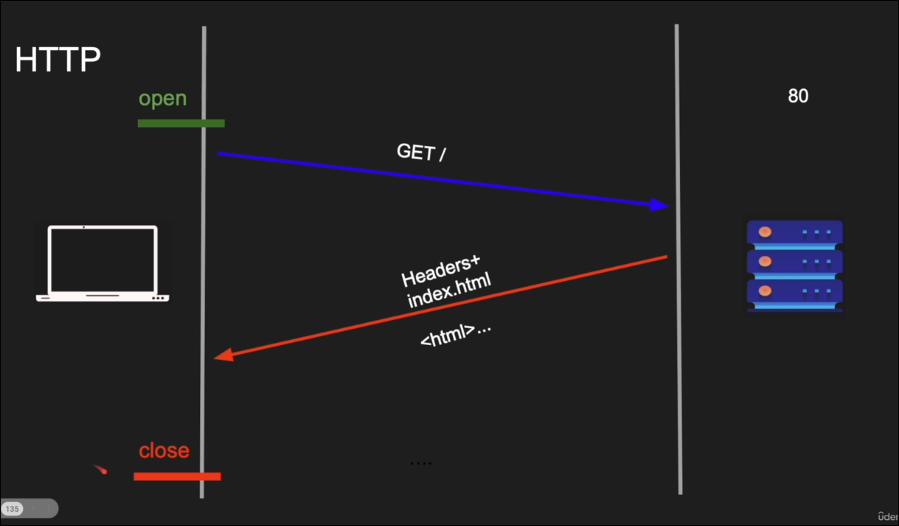
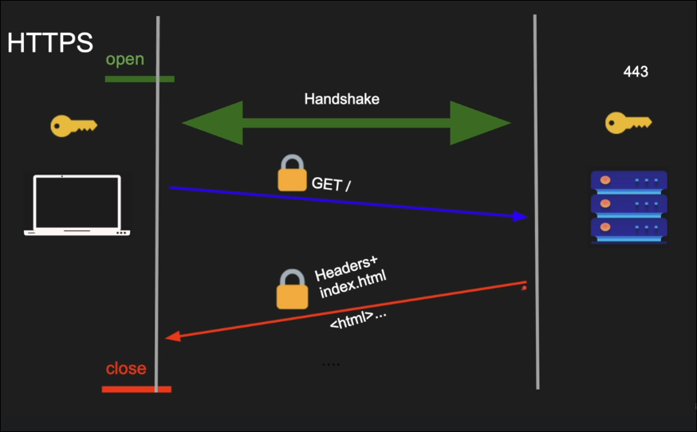
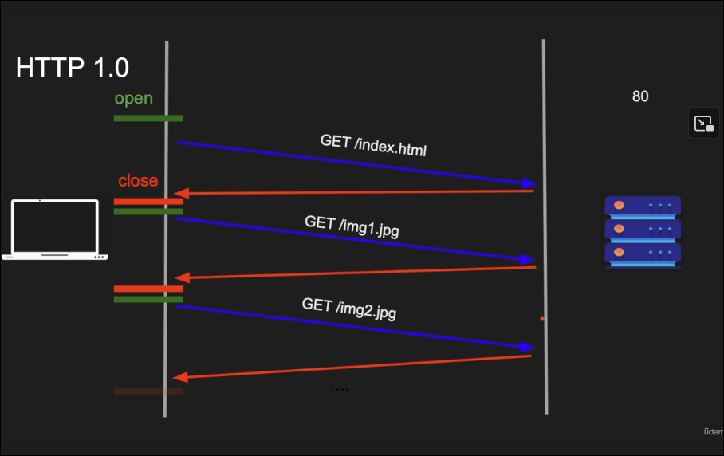
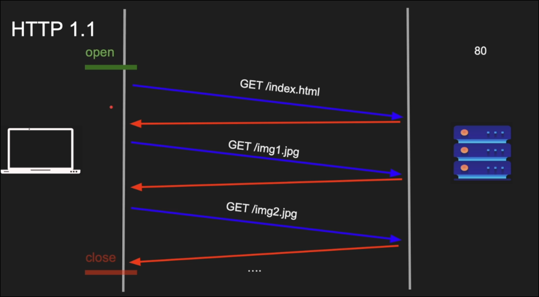
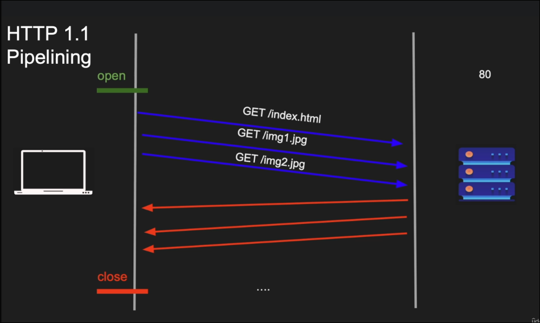

# http 1.1

______________________________________________________________________

**Date:** 2026-08-04
**Tags:**[Udemy.md](tags/Udemy.md), [Fundamentals_of_backend_engineering.md](tags/Fundamentals_of_backend_engineering.md)
**URL:**

______________________________________________________________________

## Http Request

A http request is composed of 5 parts: 
* Method: POST, DELETE, PUT, GET...
* PATH: path of the url, http://www.google.com/about
* Protocol: http 1.1/ http 2; http 3
* Headers: Cookies, Authorization, Host, etc
* Body: body of the request for post, for get is empty

```bash
curl -v http://husseinasser.com/about

> GET /about HTTP/1.1
> Host: husseinasser.com
> User-Agent: curl/7.79.1
> Accept: */*
```

## HTTP Response

A http response is composed of 4 parts

* protocol: http 1.1/ http 2; http 3
* Code: (200) ok, (404) not found, etc...
* Code Text: 200 (ok), 404 (not found), etc...
* Headers: Content-type, Content-length, Connection, Date
* Body: 

```bash
< HTTP/2 301
< location: https://www.husseinnasser.com/about
< date: Wed, 26 Oct 2022 17:10:59 GMT
< Content-type text/html; charset=UTF-8
< server: ghs
< Content-length: 232
< x-xss-protection: 0
< x-framge-options: SAMEORIGIN
<HTML><HEAD>...</HEAD></HTML>
```


## HTTP





* New TCP connection for each request
* Slow
* Buffering (transfer-encoding: chunked didnt exist)
* No multi-homed websites (HOST header) one computer for each website, not the case anymore nowadays



* Persisted TCP connection
* Low latency & low cpu usage
* Streaming with chunked transfer 
* Pipelining (disabled by default)
* Proxying & Multi-homed websites



In HTTP/1.1, pipelining means sending multiple requests on the same TCP connection without waiting for each response before sending the next request — e.g., firing off requests for /index.html, /style.css, and /logo.png back-to-back, rather than waiting for /index.html's response before requesting /style.css.

The catch: responses still had to come back in the same order the requests were sent (head-of-line blocking). So if the first request was slow, the second and third responses were stuck queued behind it even if the server had already finished them — one slow resource blocked everything after it on that connection. Because of this limitation, most browsers never enabled pipelining by default, and it was effectively abandoned in favor of just opening multiple parallel TCP connections, and later fixed properly with HTTP/2 multiplexing




## HTTP/2
* SPDY, made by google, it was called like that
* Compression, supported in the header and the body, it was disabled in http 1.1
* Multiplexing, one connection with many request with different streams ids
* Server push
* Secure by default
* Protocol negotiation during tls (NPN/ALPN)

## HTTP over QUIC (HTTP/3)

* Replaces TCP with QUIC (UDP with Congestion control)
* All Http/2 features
* Without Head of line blocking
