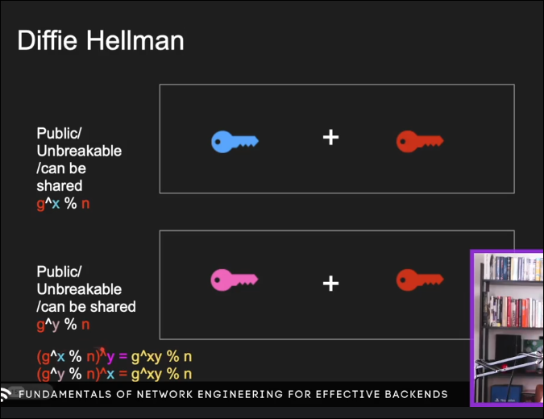
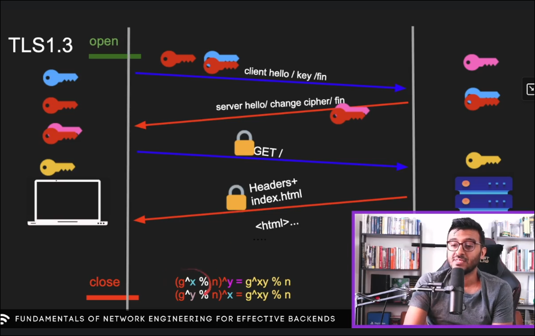

# tls

______________________________________________________________________

**Date:** 2026-07-30
**Tags:**[Udemy.md](tags/Udemy.md), [Fundamentals_of_backend_engineering.md](tags/Fundamentals_of_backend_engineering.md)
**URL:**

______________________________________________________________________

you can build tls since layer 7 (application) until the decryption model
if you want to shove into a osi model, it can be implemented in layer 5 (the session layer)

## http

client -> open connection -> GET / -> server respondas with Headers + html + etc -> close
no encrypt

## https

the same key must exist in the client and the server, the handshake, this key is gonna encrypt the data shared between those two, the key in the client encrypt and the server decrypts

## why tls

We encrypt with symmetric key algorithms, that means, one key encrypts in the client and the same key decrypts in the server.
Can be done with different keys, but its much slower.
the asymmetric key is when two different keys are in the client and server, much slower than the symmetric one.
It can be used to authenticate the server

## TLS 1.2

The rsa is one of the most popular asymmetric algorithms, it has the public and private key, the public key can be shared and the private cant.
the client sends a "hello" (ClientHello), the server responds with its own "hello" (ServerHello) plus a Certificate message containing its public key (signed by a CA). the client should verify this certificate (CA chain, hostname, expiry) before trusting the key.
the client doesn't already have a symmetric key, it generates a random pre-master secret locally, encrypts it with the server's public key, and sends it (ClientKeyExchange). the server decrypts it with its private key, recovering the same pre-master secret.
both sides then derive the same master secret / symmetric session keys from pre-master secret + client_random + server_random (exchanged in the hellos), instead of the symmetric key itself ever being transmitted.
the handshake finishes with ServerHelloDone and both sides exchanging ChangeCipherSpec + Finished messages to confirm everything matches before real data flows.
note: RSA key exchange has no forward secrecy, since the pre-master secret's protection is only the server's RSA private key. if that key leaks later, past captured traffic can be decrypted. that's why modern TLS prefers ECDHE.

## Diffie hellman

to generate the shared secret (used to derive the symmetric key), each side has a private key (client's `x`, server's `y`) and they share public parameters `g, n`. Each side computes a public value (`g^x % n` and `g^y % n`) and sends it to the other. Combining the received public value with your own private key yields the same result on both sides: `g^xy % n`.

## TLS 1.3

drops RSA key exchange entirely, every handshake uses (EC)DHE ([[Diffie hellman]]), so every session gets forward secrecy by default. also removes old/weak stuff from 1.2: static RSA, CBC ciphers, compression, renegotiation, MD5/SHA-1.

the handshake is faster too, 1-RTT (round trip time) instead of 2-RTT:
- client sends ClientHello **plus** its DH (diffie hellman) key share (guesses the group the server supports) right away, instead of waiting for a round trip to negotiate params first.
- server replies with ServerHello + its own DH key share, certificate, and Finished, all in one flight. both sides can already derive the shared secret from the two key shares at this point.
- client verifies the certificate, sends its Finished, and application data can flow immediately after — no separate ChangeCipherSpec step (that message is kept only for middlebox compatibility, it does nothing).

everything after ServerHello (certificate, extensions) is encrypted using a handshake key derived from the DH shared secret, so unlike 1.2 the certificate exchange itself isn't in plaintext anymore.

there's also 0-RTT resumption: if client and server talked before, the client can send encrypted application data in its very first flight using a pre-shared key (PSK) from the previous session, before the handshake even finishes. tradeoff: 0-RTT data has no replay protection, so it's only safe for idempotent requests.

